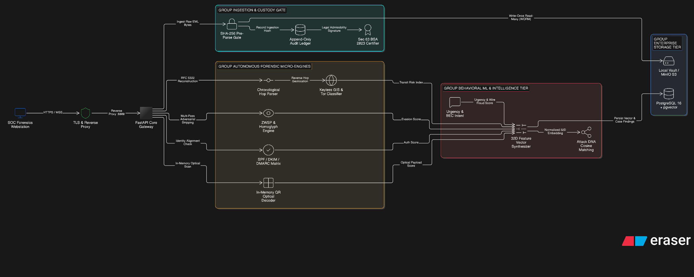
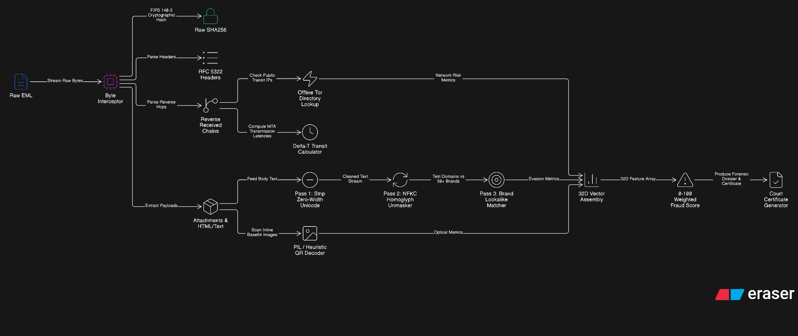
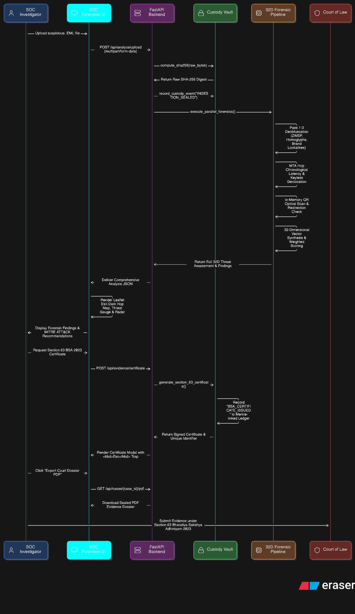
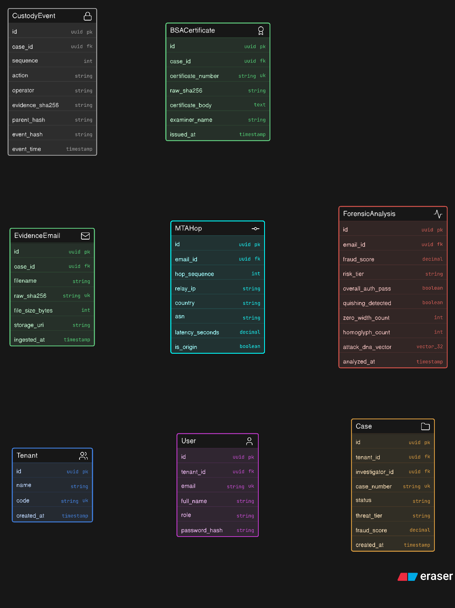

# MailTrace.AI — Unified Enterprise Forensic Intelligence & Statutory Custody Platform

**Document & Release Version:** 3.1.0 (Autonomous Zero-API-Key Forensic Edition)  
**Security Classification:** Restricted / Official  
**Statutory Compliance:** Section 63 Bharatiya Sakshya Adhiniyam (BSA) 2023 | FIPS 140-3 | RFC 5322, 7208, 6376, 7489, 8617  

---

## 1. System Overview

**MailTrace.AI** is an autonomous, evidence-grounded email threat intelligence, adversarial de-obfuscation, network infrastructure provenance, and courtroom forensic certification platform.

Unlike standard email security gateways (SEG) that provide binary SPAM/HAM tags, MailTrace.AI treats every incoming electronic message as **courtroom digital evidence**:
1. **Pre-Parsing Cryptographic Preservation:** Strict zero-alteration raw byte hashing (`SHA-256` and `HMAC-SHA256`) before any MIME parsing.
2. **Adversarial Resilience:** Robust unmasking of zero-width character evasion, Cyrillic/Greek homoglyph deception, Punycode tricks, and QR-code visual payloads (Quishing).
3. **MTA Infrastructure Reconstruction:** Hop-by-hop chronological extraction of the true internet transit path, isolating private LAN jumps from untrusted foreign origin relays.
4. **Autonomous Evidence-Grounded Scoring:** A deterministic 32-dimensional feature vector combined with NLP behavioral telemetry, where every point deduction maps to a discrete finding ID (`[F-001]` to `[F-010]`).
5. **Statutory Admissibility Compliance:** Native generation of Section 63 certificates under the **Bharatiya Sakshya Adhiniyam (BSA) 2023** (superseding Section 65B of the Indian Evidence Act 1872), incorporating SHA-256 hash chains, system hardware hashes, and examiner declarations.
6. **Zero-API-Key Autonomous Operation:** Complete elimination of external cloud API dependencies, preventing tile watermarks, rate limiting, and investigative data leakage.

---

## 2. System Architecture Diagrams (Generated via Eraser.io)

### 2.1 High-Level Design (HLD)


### 2.2 Low-Level Micro-Engine Pipeline (LLD)


### 2.3 End-to-End Dynamic Investigation Flow


### 2.4 Enterprise Relational & Vector Data Model (ERD)


---

## 3. Quick Start & Execution

### Prerequisites
- Python 3.10+
- Modern Web Browser (Chrome, Edge, Firefox)

### Installation
```bash
pip install -r requirements.txt
```

### Running Automated Test Suite
```bash
python -m pytest tests/ -v
```

### Launching the Application
```bash
python -m uvicorn backend.main:app --host 127.0.0.1 --port 8000 --reload
```
Open your browser at `http://127.0.0.1:8000` to interact with the Forensic SOC Workstation.

---

## 4. Key Endpoints

| Method | Path | Description |
| :--- | :--- | :--- |
| `GET` | `/` | Serves the unified SOC Forensics workstation interface. |
| `GET` | `/api/health` | Diagnostic health probe reporting custody ledger size and standards. |
| `GET` | `/api/samples` | Dynamically catalogs all real `.eml` files from `backend/samples/1/`. |
| `GET` | `/api/samples/{sample_id}` | Runs full 32D forensic analysis on the chosen sample. |
| `POST` | `/api/analyze/upload` | Multipart upload of custom raw RFC 5322 `.eml` evidence file. |
| `POST` | `/api/evidence/certificate` | Generates Section 63 BSA 2023 Digital Evidence Certificate. |
| `GET` | `/api/evidence/export/{case_id}` | Exports IoCs in CSV or JSON format. |
| `GET` | `/api/cases/{case_id}/pdf` | Generates and downloads sealed courtroom PDF forensic dossier. |
| `POST` | `/api/campaigns/correlate` | Executes cosine similarity clustering on 32D attack DNA vectors. |

---

## 5. License & Legal Disclaimer
Built for the Smart India Hackathon (SIH) 2026. Compliant with Section 63 of the Bharatiya Sakshya Adhiniyam, 2023.
