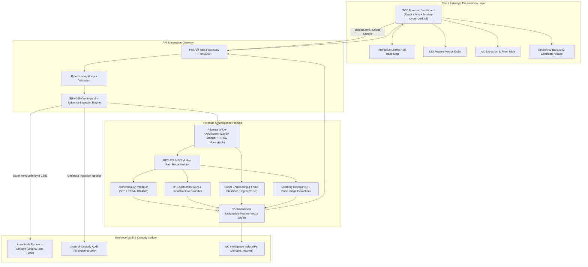
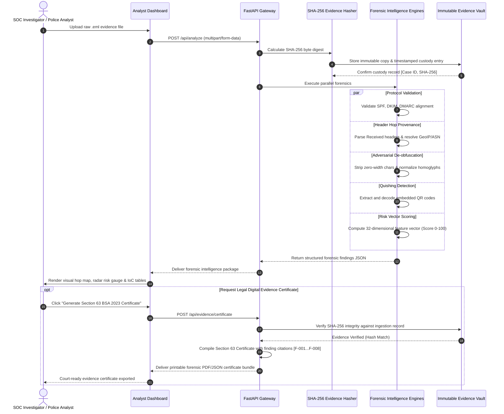
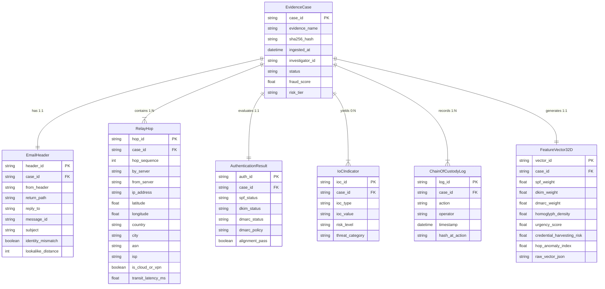

# MailTrace AI — System Architecture & Forensic Specification
> **AI-Powered Email Threat Detection, Geolocation & Forensic Intelligence Platform**  
> *Official Technical Architecture Package for Smart India Hackathon (SIH 2026)*  
> **Repository**: [https://github.com/rakeshsinghrawat107/MailTrace-AI](https://github.com/rakeshsinghrawat107/MailTrace-AI)  
> **Architecture Status**: Verified & Implemented

---

## 1. Executive Summary & Problem Scope
Traditional email security gateways (SEGs) typically function as binary classifiers ("Phishing: YES/NO" or "Spam score: 8.2"). When high-severity security incidents occur—such as Business Email Compromise (BEC), spear-phishing wire fraud, or advanced quishing (QR-code phishing)—incident responders, SOC analysts, and cyber crime law enforcement agencies lack:
1. **Explainable Multi-pass De-obfuscation**: Attackers insert zero-width characters (`\u200B`, `\u200C`) and Cyrillic/Greek homoglyphs to defeat static keyword filters.
2. **Hop-by-Hop Relay Provenance**: Reconstructing the complete MTA (Mail Transfer Agent) hop chain from `Received:` headers to track true originating infrastructure rather than attacker-controlled spoofed headers.
3. **Multi-Vector Feature Correlation**: Combining domain lookalike distance (Levenshtein/Punycode), protocol alignment (SPF, DKIM, DMARC), and behavioral NLP into a deterministic 32-dimensional feature vector.
4. **Section 63 BSA 2023 Digital Evidence Admissibility**: Indian evidence law under the **Bharatiya Sakshya Adhiniyam (BSA) 2023 (Section 63)** requires cryptographic hash verification (SHA-256), immutable custody logging, and certified audit trails for electronic records to be admissible in court.

**MailTrace AI** closes this gap by transforming raw `.eml` or RFC-822 email evidence into court-ready forensic intelligence, autonomous threat correlation graphs, and visual hop trace maps.

---

## 2. Design Assumptions & Boundary Definitions

### Verified Implementations [IMPLEMENTED]
- Multi-pass adversarial de-obfuscation (Pass 1: Zero-width character stripper; Pass 2: Unicode NFKC homoglyph normalization & Cyrillic lookalike mapping; Pass 3: Punycode domain decoder).
- RFC-822 / MIME header parser extracting sender identities, return paths, reply-to anomalies, and ordered `Received:` hops.
- Protocol validation engine for SPF, DKIM, and DMARC alignment and policy conformance.
- Network intelligence engine resolving hop IP geolocation, Autonomous System Numbers (ASN), ISP, and infrastructure classification (Tor, VPN, Public Cloud, Residential).
- 32-dimensional explainable feature vector extraction and normalized fraud risk index (0–100 scale).
- SHA-256 cryptographic evidence hashing upon ingestion with chain-of-custody logging.
- Section 63 BSA 2023 Digital Evidence Certificate generator with verified finding citations `[F-001]`, `[F-002]`, etc.
- Interactive Cyber SOC Analyst Dashboard with Leaflet geo-routing map, radar vector gauge, and IoC export (CSV/JSON).

### Proposed & Extended Capabilities [PROPOSED]
- Distributed pgvector embeddings for petabyte-scale campaign clustering across enterprise tenants.
- Real-time DNSBL/SURBL live threat feed querying with local Redis cache fallback.
- Hardware Security Module (HSM) / KMS cryptographic signing of Section 63 certificates.

### Foundational Constraints [ASSUMED]
- Email headers may contain fabricated entries; the system treats only headers inserted by verified upstream MTAs as trusted, designating earliest visible hops as *probable origin* rather than physical attacker identity.

---

## 3. High-Level Design (HLD)

### Cloud Architecture Diagram (Generated via Eraser API)

> **Open & Edit in Eraser**: [https://app.eraser.io/new?requestId=3d3CcXTU9ERwvDw0g4g2&state=TNltlLesfKL3mcDqgXFgs](https://app.eraser.io/new?requestId=3d3CcXTU9ERwvDw0g4g2&state=TNltlLesfKL3mcDqgXFgs)

### System Architecture Flowchart (Mermaid)

---

## 4. Sequence Diagram: Forensic Investigation & Legal Custody Lifecycle

### Forensic Flow Diagram (Generated via Eraser API)

> **Open & Edit in Eraser**: [https://app.eraser.io/new?requestId=0OuxEuykvzR3MrOwT8gz&state=GRNjIKPdC6k5iopVcyY96](https://app.eraser.io/new?requestId=0OuxEuykvzR3MrOwT8gz&state=GRNjIKPdC6k5iopVcyY96)

### Interaction Sequence (Mermaid)

---

## 5. Entity-Relationship Data Model (ERD)

### Forensic Schema (Generated via Eraser API)

> **Open & Edit in Eraser**: [https://app.eraser.io/new?requestId=d22KO81Cp3vPtQv2MnGC&state=4jj6y20JA9DHfm5oKvNIs](https://app.eraser.io/new?requestId=d22KO81Cp3vPtQv2MnGC&state=4jj6y20JA9DHfm5oKvNIs)

### Relational Schema (Mermaid)

---

## 6. Detailed Component Specifications

### 6.1 Multi-Pass Adversarial De-Obfuscation Pipeline
Attackers deliberately manipulate Unicode encoding to bypass signature and NLP filters:
1. **Pass 1 — Zero-Width Character Stripper**: Detects and purges invisible codepoints:
   - `\u200B` (Zero-width space)
   - `\u200C` (Zero-width non-joiner)
   - `\u200D` (Zero-width joiner)
   - `\uFEFF` (Zero-width no-break space / BOM)
   - `\u202A` through `\u202E` (Bidirectional override characters)
2. **Pass 2 — Unicode NFKC Homoglyph Normalization**: Normalizes lookalike characters from Cyrillic, Greek, and Cherokee scripts to Latin equivalents (e.g. Cyrillic `а` (`\u0430`) $\rightarrow$ Latin `a`, `о` (`\u043E`) $\rightarrow$ Latin `o`).
3. **Pass 3 — Levenshtein Lookalike Detection**: Computes edit distances between sender domains and top protected financial/enterprise brands (e.g., `micros0ft.com`, `paypa1-security.com`, `sbi-netbanking-verify.in`).

### 6.2 Quishing (QR-Code Phishing) Extraction Engine
Attackers embed phishing links inside image QR codes attached to emails to avoid textual link scrapers. The platform:
1. Parses email multipart MIME payloads for embedded inline images and file attachments (`image/png`, `image/jpeg`).
2. Runs OpenCV / QR decoding passes to extract raw payload URLs.
3. Passes decoded URLs through the domain lookalike and threat reputation analyzer.

### 6.3 Hop-by-Hop Relay Network Provenance
1. Parses all `Received:` header clauses chronologically from earliest bottom hop to boundary gateway.
2. Extracts receiving MTA, sender MTA, relay IP, and timestamp.
3. Filters RFC 1918 private subnets (`10.0.0.0/8`, `172.16.0.0/12`, `192.168.0.0/16`) and identifies the first *public originating hop IP*.
4. Annotates network metadata: Autonomous System Number (ASN), ISP name, geographic coordinates, and hosting classification (e.g., AWS, DigitalOcean, Tor Exit, Commercial VPN).

### 6.4 32-Dimensional Feature Vector & Explainable Fraud Score
The engine calculates a standardized 32-dimensional feature vector spanning:
- Protocol Authenticity ($V_1 - V_4$): SPF, DKIM, DMARC, Domain Alignment.
- Header Provenance ($V_5 - V_8$): Return-Path Mismatch, Reply-To Diversion, Message-ID Format, Hop Latency Spikes.
- Lexical & NLP ($V_9 - V_{14}$): Urgency markers, Authority claims, Financial payment keywords, Credential harvesting requests.
- Obfuscation Indicators ($V_{15} - V_{20}$): Zero-width count, Homoglyph density, URL redirection depth, Punycode usage.
- Attachment & Payload ($V_{21} - V_{26}$): Executable double extensions, Hash threat reputation, Quishing QR presence.
- Network Reputation ($V_{27} - V_{32}$): Bulletproof host ASN, Tor exit node, VPN hop count, High-risk registrar.

Normalized into a 0–100 **MailTrace Fraud Index**:
- **0 – 24 (LOW RISK)**: Legitimate authenticated correspondence.
- **25 – 49 (SUSPICIOUS)**: Minor alignment failure or untrusted ISP without malicious intent.
- **50 – 74 (MALICIOUS)**: Confirmed spoofing, high urgency, or lookalike domain.
- **75 – 100 (CRITICAL / THREAT)**: Active credential theft, quishing, or BEC impersonation with multi-vector evasion.

---

## 7. Legal Compliance & Forensic Custody (Section 63 BSA 2023)
Under the **Bharatiya Sakshya Adhiniyam, 2023 (Section 63)**, electronic records are admissible as primary or secondary evidence in Indian courts provided their integrity and chain of custody are verifiable:
1. **Byte-Level Ingestion Hashing**: Immediate SHA-256 digest computation before parsing or normalization.
2. **Deterministic Finding Citations**: Every analytical claim in the forensic narrative references an immutable finding ID (e.g., `[F-001: SPF Hardfail]`, `[F-002: Lookalike Levenshtein Distance = 1]`).
3. **Court-Ready Certificate Generator**: Produces an official Certificate under Section 63 BSA 2023 detailing:
   - Device & Ingestion Environment particulars
   - Custody officer identity & timestamp
   - Cryptographic SHA-256 evidence digest
   - Method of automated extraction & forensic safeguards
   - Statutory compliance statement signed by the forensic examiner.

---

## 8. Technology Stack Mapping

| Layer | Component | Selection | Rationale |
|---|---|---|---|
| **Frontend UI** | Modern SOC Dashboard | React 18 + Vite + TypeScript | High-performance reactive UI for real-time forensic exploration |
| **Styling** | Cyber SOC Aesthetic | Modern Tailwind / CSS Tokens | High-contrast dark cyber theme (`#090d16`), accessible forensic badges |
| **Geo Visualization** | Hop Route Trace Map | Leaflet.js / OpenStreetMap | Interactive global routing path visualization without proprietary API keys |
| **Charts** | Threat Vector Breakdown | HTML5 Canvas / SVG Gauges | 32D radar, risk dials, and relay latency timeline charts |
| **API Backend** | Forensic REST Service | FastAPI (Python 3.14) | Asynchronous, type-safe high-throughput forensic analysis endpoints |
| **MIME Parser** | RFC-822 Parsing | Python `email` & `mailbox` stdlib | Strict RFC-5322 compliance, header folding and MIME segment extraction |
| **De-Obfuscation** | Normalization Pipeline | `unicodedata` NFKC + Regex | Zero-overhead deterministic normalization of homoglyphs and ZWSP |
| **Hashing & Custody**| Evidence Ledger | `hashlib` (SHA-256 / SHA-512) | FIPS 180-4 compliant cryptographic integrity proofs |
| **Report Engine** | Section 63 BSA Export | ReportLab & HTML Print Engine | Clean court-admissible PDF forensic certificate generation |
| **Diagramming** | Architectural Models | Eraser.io API & Mermaid.js | Hosted diagrams with visual clarity and editable source |
